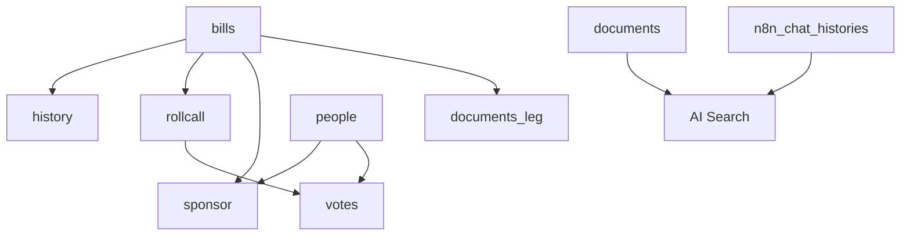

# 🏛️ Shadow Congress Complete Database Schema

## 🎯 Overview

Your Shadow Congress application has a **comprehensive legislative database** with full congressional data structure! This is a production-ready schema for tracking bills, legislators, votes, and legislative history.

## 📊 Complete Database Structure

### **1. Bills Table** (`bills`)
**Core legislative bills and status tracking**
```sql
CREATE TABLE public.bills (
  bill_id text PRIMARY KEY,           -- Unique bill identifier
  session_id integer,                 -- Congressional session
  bill_number text,                   -- Official bill number (HR-1234, S-567)
  status text,                        -- Current status 
  status_desc text,                   -- Status description
  status_date date,                   -- Status change date
  title text,                         -- Bill title
  description text,                   -- Bill summary
  committee_id text,                  -- Assigned committee ID
  committee text,                     -- Committee name
  last_action_date date,              -- Most recent action date
  last_action text,                   -- Most recent action description
  url text,                           -- Official bill URL
  state_link text,                    -- State-specific link
  full_bill_text text,                -- Complete bill text
  change_hash text                    -- Version tracking hash
);
```

### **2. People Table** (`people`)
**Legislators and congressional members**
```sql
CREATE TABLE public.people (
  people_id text PRIMARY KEY,         -- Unique person identifier
  name text,                          -- Full name
  first_name text,                    -- First name
  middle_name text,                   -- Middle name
  last_name text,                     -- Last name
  suffix text,                        -- Name suffix (Jr., Sr., etc.)
  nickname text,                      -- Common nickname
  party_id text,                      -- Political party ID
  party text,                         -- Political party name
  role_id text,                       -- Position role ID
  role text,                          -- Position title (Senator, Representative)
  district text,                      -- Electoral district
  followthemoney_eid text,            -- Follow The Money ID
  votesmart_id text,                  -- Vote Smart ID
  opensecrets_id text,                -- OpenSecrets ID
  ballotpedia text,                   -- Ballotpedia identifier
  knowwho_pid text,                   -- KnowWho platform ID
  committee_id text                   -- Committee assignment
);
```

### **3. History Table** (`history`)
**Legislative action timeline**
```sql
CREATE TABLE public.history (
  history_id integer PRIMARY KEY,     -- Unique history record
  bill_id text,                       -- References bills(bill_id)
  date date,                          -- Action date
  chamber text,                       -- House/Senate
  sequence integer,                   -- Action sequence number
  action text                         -- Action description
);
```

### **4. Rollcall Table** (`rollcall`)
**Voting session records**
```sql
CREATE TABLE public.rollcall (
  roll_call_id text PRIMARY KEY,      -- Unique vote session ID
  bill_id text,                       -- References bills(bill_id)
  date date,                          -- Vote date
  chamber text,                       -- House/Senate
  description text,                   -- Vote description
  yea integer,                        -- Yes votes count
  nay integer,                        -- No votes count
  nv integer,                         -- Not voting count
  absent integer,                     -- Absent count
  total integer                       -- Total possible votes
);
```

### **5. Votes Table** (`votes`)
**Individual legislator votes**
```sql
CREATE TABLE public.votes (
  vote_id integer PRIMARY KEY,        -- Unique vote record
  roll_call_id text,                  -- References rollcall(roll_call_id)
  people_id text,                     -- References people(people_id)
  vote text,                          -- Vote value (Y/N/NV/A)
  vote_desc text                      -- Vote description
);
```

### **6. Sponsor Table** (`sponsor`)
**Bill sponsorship relationships**
```sql
CREATE TABLE public.sponsor (
  sponsor_id integer PRIMARY KEY,     -- Unique sponsorship record
  bill_id text,                       -- References bills(bill_id)
  people_id text,                     -- References people(people_id)
  position text,                      -- Sponsor/Co-sponsor
  has_bill_id boolean                 -- Sponsorship validation flag
);
```

### **7. Documents Table** (`documents`)
**AI/Search document embeddings**
```sql
CREATE TABLE public.documents (
  id bigint PRIMARY KEY,              -- Unique document ID
  content text,                       -- Document content
  metadata jsonb,                     -- Document metadata
  embedding USER-DEFINED              -- Vector embedding for AI search
);
```

### **8. Documents Leg Table** (`documents_leg`)
**Legislative document attachments**
```sql
CREATE TABLE public.documents_leg (
  document_id text PRIMARY KEY,       -- Unique document identifier
  bill_id text,                       -- References bills(bill_id)
  document_type text,                 -- Document type (PDF, etc.)
  document_size integer,              -- File size
  document_mime text,                 -- MIME type
  document_desc text,                 -- Document description
  url text,                           -- Document URL
  state_link text                     -- State-specific link
);
```

### **9. Chat Histories Table** (`n8n_chat_histories`)
**User AI conversations**
```sql
CREATE TABLE public.n8n_chat_histories (
  id integer PRIMARY KEY,             -- Unique chat record
  session_id varchar NOT NULL,        -- Chat session identifier
  message jsonb NOT NULL              -- Message data (user/AI)
);
```

## 🔗 Data Relationships



## 🚀 Real Data Integration Plan

### **Phase 1: Basic Bill Display** ✅ Ready
```typescript
// Example query for bills
const { data: bills } = await supabase
  .from('bills')
  .select(`
    bill_id,
    bill_number,
    title,
    status,
    status_desc,
    last_action,
    last_action_date,
    description
  `)
  .order('last_action_date', { ascending: false })
  .limit(20);
```

### **Phase 2: Legislator Profiles** ✅ Ready
```typescript
// Example query for legislators
const { data: legislators } = await supabase
  .from('people')
  .select(`
    people_id,
    name,
    party,
    role,
    district
  `)
  .eq('role', 'Representative')
  .order('name');
```

### **Phase 3: Voting Records** ✅ Ready
```typescript
// Example query for voting records
const { data: voteHistory } = await supabase
  .from('votes')
  .select(`
    vote,
    vote_desc,
    rollcall:rollcall_id (
      date,
      description,
      bill:bill_id (
        title,
        bill_number
      )
    ),
    person:people_id (
      name,
      party
    )
  `)
  .eq('people_id', 'specific_legislator_id');
```

### **Phase 4: Bill Sponsorship** ✅ Ready
```typescript
// Example query for bill sponsors
const { data: sponsors } = await supabase
  .from('sponsor')
  .select(`
    position,
    bill:bill_id (
      title,
      bill_number
    ),
    person:people_id (
      name,
      party,
      role
    )
  `)
  .eq('bill_id', 'specific_bill_id');
```

## 💡 Key Insights About Your Schema

### **🎯 Strengths:**
1. **Complete Legislative Coverage**: Bills, legislators, votes, sponsorship
2. **Rich Metadata**: Multiple ID systems for cross-referencing
3. **AI-Ready**: Document embeddings and chat history
4. **Audit Trail**: Full legislative history tracking
5. **Flexible Structure**: JSONB fields for extensibility

### **🚀 Ready-to-Use Features:**
- ✅ **Bill Tracking**: Complete bill lifecycle
- ✅ **Legislator Profiles**: Full member information
- ✅ **Voting Analysis**: Individual and roll call votes
- ✅ **Sponsorship Tracking**: Primary and co-sponsors
- ✅ **Document Management**: Attachments and embeddings
- ✅ **AI Chat Integration**: Already working

### **📈 Advanced Capabilities:**
- **Trend Analysis**: Track voting patterns over time
- **Coalition Building**: Identify co-sponsorship networks
- **Legislative Prediction**: Use voting history for AI predictions
- **Document Search**: Vector search through bill text
- **Real-time Updates**: Track bill status changes

## 🛠️ Implementation Priority

### **High Priority** (Immediate Use)
1. **Bills Dashboard**: Display recent bills with status
2. **Legislator Directory**: Searchable member list
3. **Bill Details**: Full bill view with history and sponsors
4. **Search Functionality**: Search bills by title/number

### **Medium Priority** (Next Phase)
1. **Voting Records**: Individual legislator voting history
2. **Committee Tracking**: Committee-based bill organization
3. **Document Viewer**: PDF/document attachment display
4. **Advanced Filters**: Multi-criteria bill filtering

### **Advanced Features** (Future Enhancement)
1. **Voting Pattern Analysis**: AI-powered voting predictions
2. **Sponsorship Networks**: Visual relationship mapping
3. **Bill Similarity**: AI comparison of bill content
4. **Real-time Notifications**: Bill status change alerts

## 🔧 Next Development Steps

1. **Create TypeScript interfaces** for all tables
2. **Build data fetching hooks** for each entity type
3. **Update existing pages** to display real data
4. **Implement search and filtering**
5. **Add data visualization components**

Your database is **production-ready** with comprehensive legislative data! 🎉